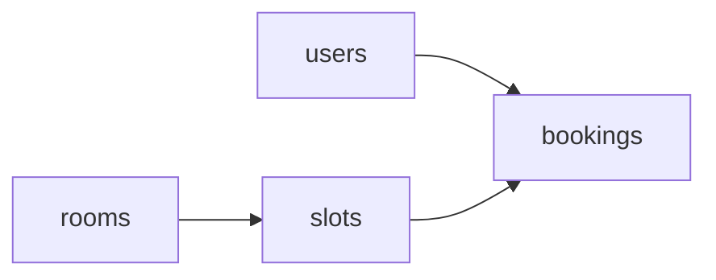

# ARCHITECTURE

## Principle: MVC, client-server

The API is the **server**. Any client (a frontend later, Swagger UI, Postman) talks to it over HTTP + JSON. The structure follows the MVC example given by the teacher, with one file per resource inside each folder.

| MVC | Folder | Role |
|-----|--------|------|
| Model | `models/` | SQLAlchemy tables |
| View | `schemas/` | Pydantic request/response (the JSON the client sees) |
| Controller | `controllers/` | Business rules (BR-*), raise domain errors |
| Routes | `routes/` | HTTP only: parse request, call the controller, return the response |

```
.env                     # at the project root (not in back/), never committed
.env.example             # project root, committed, no secrets
Dockerfile               # project root, Ticket 002
docker-compose.yml       # project root, Ticket 002: API + PostgreSQL
back/
  app/
    main.py              # creates FastAPI app, includes the routes
    config/              # pydantic-settings, reads .env; logging setup
    database/            # engine, SessionLocal, get_db, declarative Base
    models/              # user.py  room.py  time_slot.py  booking.py
    schemas/             # user.py  room.py  time_slot.py  booking.py
    controllers/         # user.py  room.py  time_slot.py  booking.py
    routes/              # user.py  room.py  time_slot.py  booking.py
    core/                # errors.py (BR-X1), security.py (Sprint 2: JWT, roles)
  alembic/
  tests/
    conftest.py          # shared fixtures: db session, client
    test_users.py  test_rooms.py  test_time_slots.py  test_bookings.py
  requirements.txt
```

Four people work in parallel: each one owns the files of their resource in every folder (`models/room.py`, `routes/room.py`...), so merge conflicts stay rare.

Routes never hold business rules, controllers never import FastAPI. Rules can be tested without HTTP.

The frontend is out of scope for now. If there is time, it will be a separate client in `front/` that uses this API.

## Dependencies between resources



`bookings` depends on the other three. To avoid blocking, the foundation tickets create all four models and the first migration on day 1, so everyone can work against the real schema.

## Shared conventions

- Table names plural snake_case (`time_slots`), Python models singular (`TimeSlot`).
- Endpoints plural kebab-case under `/api/v1` (e.g. `/api/v1/time-slots`). See `API_CONTRACT.md`.
- One error format (BR-X1), raised through `core/errors.py`.
- Sessions via the `get_db` dependency, overridden in tests.

## Test strategy

| Level | What | Where |
|-------|------|-------|
| Unit | Controller rules with a test DB session | `tests/test_<resource>.py` |
| API | Each endpoint through `TestClient`, happy path + each error | `tests/test_<resource>.py` |

Tests are written together with the code, in the same ticket and PR (no test-first rule).

Minimum per endpoint (course requirement): one success test and one failing test per business rule it enforces.
