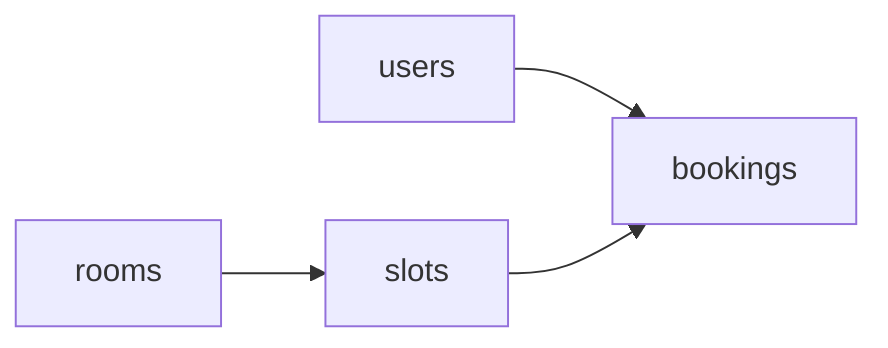

# ARCHITECTURE

## Principle: MVC, client-server

The API is the **server**. Any client (the React front, Swagger UI, Postman) talks to it over HTTP + JSON. The structure follows the MVC example given by the teacher, with one file per resource inside each folder.

| MVC | Folder | Role |
|-----|--------|------|
| Model | `models/` | SQLAlchemy tables |
| View | `schemas/` | Pydantic request/response (the JSON the client sees) |
| Controller | `controllers/` | Business rules (BR-*), raise domain errors |
| Routes | `routes/` | HTTP only: parse request, call the controller, return the response |

```
.env                     # at the project root (not in back/), never committed
.env.example             # project root, committed, no secrets
Dockerfile               # project root, Ticket 002
docker-compose.yml       # project root, Ticket 002: API + PostgreSQL
pyproject.toml           # project root: dependencies, ruff and pytest config
alembic.ini              # project root, Ticket 002
alembic/                 # project root: env.py and versions/ (migrations)
back/
  app/
    main.py              # creates FastAPI app, includes the routes
    config/              # pydantic-settings, reads .env; logging setup
    database.py          # engine, SessionLocal, declarative Base (get_db comes with the first routes)
    models/              # user.py  room.py  time_slot.py  booking.py
    schemas/             # user.py  room.py  time_slot.py  booking.py
    controllers/         # user.py  room.py  time_slot.py  booking.py
    routes/              # user.py  room.py  time_slot.py  booking.py
    core/                # errors.py (BR-X1), security.py (Sprint 2: JWT, roles)
  tests/
    conftest.py          # shared fixtures: db session, client
    test_users.py  test_rooms.py  test_time_slots.py  test_bookings.py
```

Four people work in parallel: each one owns the files of their resource in every folder (`models/room.py`, `routes/room.py`...), so merge conflicts stay rare.

Routes never hold business rules, controllers never import FastAPI. Rules can be tested without HTTP.

The frontend is a separate client in `front/` that only uses this API over HTTP (see the Frontend section below).

## Frontend

React client (Vite, JavaScript), served by Nginx in Docker. It never shares code with the back: the contract is `API_CONTRACT.md`. Stack: `STACK.md`.

### Structure: one folder per feature

```
front/
  Dockerfile  nginx.conf        # Node build, then Nginx: SPA fallback + /api proxy to the API
  src/
    main.jsx
    app/        # wiring only: App, providers (QueryClient + Router), routes, layout. No business logic
    features/   # one self-contained folder per feature
      rooms/ corridor/ booking/ my-bookings/ auth/ profile/
      staff/ admin-rooms/ admin-users/ admin-stats/
    shared/     # reusable, knows no feature: api (Axios client, error mapping), hooks, lib, ui
    styles/     # Sass: bespoke effects only (atmosphere, room gate, 3D overlay)
    i18n/       # es.js composes one namespace per feature (i18n/es/<feature>.js)
    test/       # setup and MSW handlers (one file per feature)
```

Inside a feature: `api/` (Axios calls), `hooks/` (TanStack Query), `model/` (pure logic, schemas, mappers), `components/`, `pages/`, `routes.js` (its routes) and `index.js` (its public API).

### Rules (enforced by ESLint)

```
app  ->  features  ->  shared
```

- `shared` imports no feature and no `app`; a feature never imports `app`.
- A feature imports another feature **only through its `index.js`** (`@/features/rooms`), never its internals.
- Imports across folders use the `@` alias (= `src/`); inside a feature use relative paths and never leave the feature with `../`.
- Each feature owns its routes (`features/<name>/routes.js`); `app/routes.jsx` only composes them. Same for i18n and MSW handlers: one file per feature, so people working on different tickets do not edit the same file.

### Data flow

`Page -> custom hook (TanStack Query) -> api function -> Axios -> FastAPI`. A **mapper** turns the API response into a view model so the UI never depends on backend field names. Backend error codes (`SLOT_TAKEN`, `TOO_LATE_TO_CANCEL`...) are mapped to Spanish messages in `shared/api/errors.js` and in each feature's `model/errors.js`.

| State | Where it lives |
|-------|----------------|
| Rooms, slots, bookings (server data) | TanStack Query cache |
| Room / day / slot / players being chosen | Zustand store (booking draft) |
| Current page and room | URL |
| Logged-in user and role | Context (`AuthProvider`) |
| Door hover/selected, camera | inside the 3D module, not in React state |

### 3D corridor

`createCorridor(container, { rooms, onEnter })` is plain Three.js and returns `{ dispose }`. The React component only creates it in `useEffect` and calls `dispose()` on cleanup, so the 60 fps loop stays out of React. If WebGL is missing, or on small screens or with reduced motion, the room posters are shown instead, and the booking flow never depends on the 3D.

### Access control

`<RequireRole role="staff">` hides routes by role in the UI. The API remains the real authority (`BUSINESS_RULES.md`).

### Environments

- **Docker:** `docker compose up` starts `api`, `db` and `front` (http://localhost:3000). Nginx proxies `/api/` to the API, so the browser talks to one origin and no CORS setup is needed.
- **Dev:** `npm run dev` in `front/` (Vite, hot reload) with the proxy `/api` -> `localhost:8000`, same relative URL as in Docker.

## Dependencies between resources



`bookings` depends on the other three. To avoid blocking, the foundation tickets create all four models and the first migration on day 1, so everyone can work against the real schema.

## Shared conventions

- Table names plural snake_case (`time_slots`), Python models singular (`TimeSlot`).
- Endpoints plural kebab-case under `/api/v1` (e.g. `/api/v1/time-slots`). See `API_CONTRACT.md`.
- One error format (BR-X1), raised through `core/errors.py`.
- Sessions via the `get_db` dependency, overridden in tests.

## Test strategy

| Level | What | Where |
|-------|------|-------|
| Unit | Controller rules with a test DB session | `tests/test_<resource>.py` |
| API | Each endpoint through `TestClient`, happy path + each error | `tests/test_<resource>.py` |

Tests are written together with the code, in the same ticket and PR (no test-first rule).

Minimum per endpoint (course requirement): one success test and one failing test per business rule it enforces.

### Front tests

| Level | What | Tool |
|-------|------|------|
| Pure logic | `slotState`, `price`, 24h rule, game transitions, door state machine, mappers, schemas | Vitest, written test-first |
| Components and pages | Disabled slots, players min/max, checkout validation, `SLOT_TAKEN` flow | Testing Library + MSW (mocks of the FastAPI) |
| 3D | Not unit-tested (WebGL); covered by the door state machine tests and a manual checklist | - |
