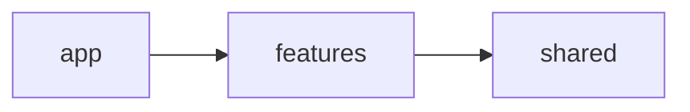
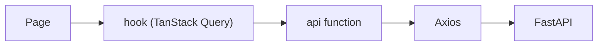
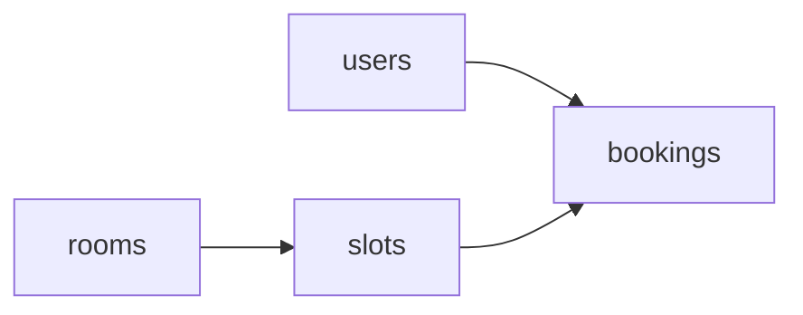

# ARCHITECTURE

## Principle: MVC, client-server

The API is the **server**. Any client (the React front, Swagger UI, Postman) talks to it over HTTP + JSON. The structure follows the MVC example given by the teacher, with one file per resource inside each folder.

| MVC | Folder | Role |
|-----|--------|------|
| Model | `models/` | SQLAlchemy tables |
| View | `schemas/` | Pydantic request/response (the JSON the client sees) |
| Controller | `controllers/` | Business rules (BR-*), raise domain errors |
| Routes | `routes/` | HTTP only: parse request, call the controller, return the response |

```
.env                     # at the project root (not in back/), never committed
.env.example             # project root, committed, no secrets
Dockerfile               # project root, Ticket 002
docker-compose.yml       # project root, Ticket 002: API + PostgreSQL
pyproject.toml           # project root: dependencies, ruff and pytest config
alembic.ini              # project root, Ticket 002
alembic/                 # project root: env.py and versions/ (migrations)
back/
  app/
    main.py              # creates FastAPI app, includes the routes
    config/              # pydantic-settings, reads .env; logging setup
    database.py          # engine, SessionLocal, declarative Base (get_db comes with the first routes)
    models/              # user.py  room.py  time_slot.py  booking.py
    schemas/             # user.py  room.py  time_slot.py  booking.py
    controllers/         # user.py  room.py  time_slot.py  booking.py
    routes/              # user.py  room.py  time_slot.py  booking.py
    core/                # errors.py (BR-X1), security.py (Sprint 2: JWT, roles)
  tests/
    conftest.py          # shared fixtures: db session, client
    test_users.py  test_rooms.py  test_time_slots.py  test_bookings.py
```

Four people work in parallel: each one owns the files of their resource in every folder (`models/room.py`, `routes/room.py`...), so merge conflicts stay rare.

Routes never hold business rules, controllers never import FastAPI. Rules can be tested without HTTP.

The frontend is a separate client in `front/` that only uses this API over HTTP (see the Frontend section below).

## Frontend

React client (Vite, JavaScript), served by Nginx in Docker. It never shares code with the back: the contract is `API_CONTRACT.md`. Stack: `STACK.md`.

### Structure

Complete layout of `front/` as scaffolded by ticket 064 (folders first, then files; each feature follows the same shape, see below).

```
front/
├── public/
│   ├── favicon.svg
│   └── icons.svg
├── src/
│   ├── app/
│   │   ├── layout/
│   │   │   └── NavBar.jsx                 # role-based navigation (ticket 078)
│   │   ├── App.jsx                        # Providers + routes
│   │   ├── providers.jsx                  # QueryClientProvider + BrowserRouter
│   │   ├── routes.jsx                     # composes the routes owned by each feature
│   │   └── routes.test.jsx                # each feature exports its routes; "/" renders
│   ├── features/
│   │   ├── admin-rooms/
│   │   │   ├── api/
│   │   │   │   ├── adminRoomsApi.js
│   │   │   │   └── adminSlotsApi.js
│   │   │   ├── components/
│   │   │   │   ├── RoomForm.jsx
│   │   │   │   ├── RoomsTable.jsx
│   │   │   │   ├── SlotForm.jsx
│   │   │   │   └── SlotsTable.jsx
│   │   │   ├── hooks/
│   │   │   │   ├── useAdminRooms.js
│   │   │   │   ├── useAdminSlots.js
│   │   │   │   └── useSaveRoom.js
│   │   │   ├── model/
│   │   │   │   ├── errors.js
│   │   │   │   ├── roomSchema.js          # Zod schema
│   │   │   │   └── slotSchema.js          # Zod schema
│   │   │   ├── pages/
│   │   │   │   ├── AdminRoomsPage.jsx     # /admin/salas
│   │   │   │   └── AdminSlotsPage.jsx     # /admin/salas/:id/horarios
│   │   │   ├── index.js                   # public API of the feature
│   │   │   └── routes.js                  # routes of this feature
│   │   ├── admin-stats/
│   │   │   ├── api/
│   │   │   │   └── adminStatsApi.js
│   │   │   ├── components/
│   │   │   │   ├── BookingsPerRoom.jsx
│   │   │   │   ├── ExportCsvButton.jsx    # CSV export
│   │   │   │   └── KpiCards.jsx
│   │   │   ├── hooks/
│   │   │   │   └── useStats.js
│   │   │   ├── pages/
│   │   │   │   └── AdminStatsPage.jsx
│   │   │   ├── index.js                   # public API of the feature
│   │   │   └── routes.js                  # routes of this feature
│   │   ├── admin-users/
│   │   │   ├── api/
│   │   │   │   └── adminUsersApi.js
│   │   │   ├── components/
│   │   │   │   └── UsersTable.jsx
│   │   │   ├── hooks/
│   │   │   │   ├── useAdminUsers.js
│   │   │   │   └── useUpdateUser.js
│   │   │   ├── pages/
│   │   │   │   └── AdminUsersPage.jsx
│   │   │   ├── index.js                   # public API of the feature
│   │   │   └── routes.js                  # routes of this feature
│   │   ├── auth/
│   │   │   ├── api/
│   │   │   │   └── authApi.js             # session / first login
│   │   │   ├── components/
│   │   │   │   ├── AuthProvider.jsx       # Context: user + role
│   │   │   │   └── RequireRole.jsx        # route guard (API stays the authority)
│   │   │   ├── hooks/
│   │   │   │   └── useAuth.js
│   │   │   ├── model/
│   │   │   │   └── supabaseClient.js      # single Supabase client (Google login)
│   │   │   ├── pages/
│   │   │   │   └── LoginPage.jsx
│   │   │   ├── index.js                   # public API of the feature
│   │   │   └── routes.js                  # routes of this feature
│   │   ├── booking/
│   │   │   ├── api/
│   │   │   │   └── bookingApi.js          # slots + create booking
│   │   │   ├── components/
│   │   │   │   ├── DayPicker.jsx          # day selection
│   │   │   │   ├── PlayersDial.jsx        # players selector (safe dial)
│   │   │   │   ├── SlotGrid.jsx           # slots with states
│   │   │   │   ├── Stamp.jsx              # confirmation stamp animation
│   │   │   │   └── Ticket.jsx             # booking ticket
│   │   │   ├── hooks/
│   │   │   │   ├── useCreateBooking.js    # create booking mutation
│   │   │   │   └── useSlots.js            # slots of a room and day
│   │   │   ├── model/
│   │   │   │   ├── bookingDraft.store.js  # Zustand: booking in progress
│   │   │   │   ├── checkoutSchema.js      # Zod schema of the checkout form
│   │   │   │   ├── errors.js              # booking error codes (SLOT_TAKEN...)
│   │   │   │   ├── price.js               # price (rule D-01 open: fixed per player)
│   │   │   │   └── slotState.js           # past / taken / blocked / free (pure)
│   │   │   ├── pages/
│   │   │   │   ├── BookingPage.jsx        # /reservar/:slug
│   │   │   │   ├── CheckoutPage.jsx       # checkout
│   │   │   │   └── ConfirmationPage.jsx   # confirmation
│   │   │   ├── index.js                   # public API of the feature
│   │   │   └── routes.js                  # routes of this feature
│   │   ├── corridor/
│   │   │   ├── Corridor.jsx               # useEffect: create / dispose()
│   │   │   ├── CorridorFallback.jsx       # poster grid when no WebGL
│   │   │   ├── createCorridor.js          # pure Three.js, returns { dispose }
│   │   │   ├── doorMachine.js             # door state machine (pure)
│   │   │   ├── index.js                   # public API of the feature
│   │   │   └── useWebGLSupport.js         # WebGL detection
│   │   ├── my-bookings/
│   │   │   ├── api/
│   │   │   │   └── myBookingsApi.js       # list, update, cancel, change slot, history
│   │   │   ├── components/
│   │   │   │   ├── BookingCard.jsx
│   │   │   │   ├── BookingTabs.jsx
│   │   │   │   ├── CancelDialog.jsx
│   │   │   │   ├── ChangeSlotDialog.jsx
│   │   │   │   ├── GameHistory.jsx
│   │   │   │   └── ModifyPlayersDialog.jsx
│   │   │   ├── hooks/
│   │   │   │   ├── useCancelBooking.js
│   │   │   │   ├── useChangeSlot.js
│   │   │   │   ├── useGameHistory.js
│   │   │   │   ├── useMyBookings.js
│   │   │   │   └── useUpdateBooking.js
│   │   │   ├── model/
│   │   │   │   ├── bookingFilters.js      # tab filters (pure)
│   │   │   │   ├── canModify.js           # 24h rule (pure)
│   │   │   │   └── errors.js              # TOO_LATE_TO_CANCEL / TOO_LATE_TO_MODIFY ...
│   │   │   ├── pages/
│   │   │   │   ├── GameHistoryPage.jsx
│   │   │   │   └── MyBookingsPage.jsx
│   │   │   ├── index.js                   # public API of the feature
│   │   │   └── routes.js                  # routes of this feature
│   │   ├── profile/
│   │   │   ├── api/
│   │   │   │   └── userApi.js             # /users/me
│   │   │   ├── hooks/
│   │   │   │   ├── useMe.js
│   │   │   │   └── useUpdateMe.js
│   │   │   ├── model/
│   │   │   │   └── profileSchema.js       # Zod schema
│   │   │   ├── pages/
│   │   │   │   └── ProfilePage.jsx
│   │   │   ├── index.js                   # public API of the feature
│   │   │   └── routes.js                  # routes of this feature
│   │   ├── rooms/
│   │   │   ├── api/
│   │   │   │   └── roomsApi.js            # GET /rooms ...
│   │   │   ├── components/
│   │   │   │   ├── Atmosphere.jsx         # clock / beam / dust / lasers
│   │   │   │   ├── GateTransition.jsx     # room entrance animation
│   │   │   │   ├── RoomHero.jsx           # room detail header
│   │   │   │   └── RoomPoster.jsx         # room card
│   │   │   ├── hooks/
│   │   │   │   ├── useRoom.js             # TanStack Query: detail
│   │   │   │   └── useRooms.js            # TanStack Query: list
│   │   │   ├── model/
│   │   │   │   ├── roomMapper.js          # API response -> view model
│   │   │   │   └── roomThemes.js          # REGISTRY slug -> colours, ambiance, entrance
│   │   │   ├── pages/
│   │   │   │   ├── RoomPage.jsx           # /salas/:slug
│   │   │   │   └── RoomsPage.jsx          # /salas
│   │   │   ├── index.js                   # public API of the feature
│   │   │   └── routes.js                  # routes of this feature
│   │   └── staff/
│   │       ├── api/
│   │       │   └── staffApi.js
│   │       ├── components/
│   │       │   ├── GameActions.jsx
│   │       │   ├── ResultForm.jsx
│   │       │   └── TodayBookingsTable.jsx
│   │       ├── hooks/
│   │       │   ├── useFinishGame.js
│   │       │   ├── useRegisterResult.js
│   │       │   ├── useStartGame.js
│   │       │   └── useTodayBookings.js
│   │       ├── model/
│   │       │   ├── errors.js
│   │       │   ├── gameTransitions.js     # actions allowed per booking status (pure)
│   │       │   └── resultSchema.js        # Zod schema of the game result
│   │       ├── pages/
│   │       │   └── StaffPlanningPage.jsx  # today's board
│   │       ├── index.js                   # public API of the feature
│   │       └── routes.js                  # routes of this feature
│   ├── i18n/
│   │   ├── es/
│   │   │   ├── adminRooms.js              # texts (Spanish) of adminRooms
│   │   │   ├── adminStats.js              # texts (Spanish) of adminStats
│   │   │   ├── adminUsers.js              # texts (Spanish) of adminUsers
│   │   │   ├── auth.js                    # texts (Spanish) of auth
│   │   │   ├── booking.js                 # texts (Spanish) of booking
│   │   │   ├── common.js                  # texts (Spanish) of common
│   │   │   ├── myBookings.js              # texts (Spanish) of myBookings
│   │   │   ├── profile.js                 # texts (Spanish) of profile
│   │   │   ├── rooms.js                   # texts (Spanish) of rooms
│   │   │   └── staff.js                   # texts (Spanish) of staff
│   │   ├── es.js                          # composes the namespaces
│   │   └── es.test.js
│   ├── shared/
│   │   ├── api/
│   │   │   ├── client.js                  # the only Axios instance (/api/v1, JWT interceptor)
│   │   │   └── errors.js                  # generic backend error mapping
│   │   ├── hooks/
│   │   │   ├── useCountdown.js
│   │   │   ├── usePagination.js
│   │   │   └── useReducedMotion.js
│   │   ├── lib/
│   │   │   └── format.js                  # price and date formatting
│   │   └── ui/
│   │       ├── Badge.jsx
│   │       ├── Button.jsx
│   │       ├── Chip.jsx
│   │       ├── Pagination.jsx
│   │       ├── Skeleton.jsx
│   │       └── Toast.jsx
│   ├── styles/
│   │   ├── atmosphere.scss                # ambiance effects
│   │   ├── corridor.scss                  # 3D overlay (caption, tooltip)
│   │   └── gate.scss                      # room entrance animations
│   ├── test/
│   │   ├── mocks/
│   │   │   ├── handlers/
│   │   │   │   ├── adminRooms.js          # MSW handlers of adminRooms
│   │   │   │   ├── adminStats.js          # MSW handlers of adminStats
│   │   │   │   ├── adminUsers.js          # MSW handlers of adminUsers
│   │   │   │   ├── auth.js                # MSW handlers of auth
│   │   │   │   ├── booking.js             # MSW handlers of booking
│   │   │   │   ├── myBookings.js          # MSW handlers of myBookings
│   │   │   │   ├── profile.js             # MSW handlers of profile
│   │   │   │   ├── rooms.js               # MSW handlers of rooms
│   │   │   │   └── staff.js               # MSW handlers of staff
│   │   │   ├── handlers.js                # composes the per-feature handlers
│   │   │   ├── handlers.test.js
│   │   │   └── server.js                  # MSW server
│   │   └── setup.js                       # Vitest + jest-dom
│   ├── index.css                          # Tailwind entry
│   └── main.jsx                           # entry point: mounts <App />
├── .dockerignore                          # node_modules, dist, .git
├── .prettierignore                        # files Prettier skips
├── .prettierrc                            # format rules (100 chars, no semicolons, single quotes)
├── Dockerfile                             # Node 20 build, then Nginx
├── eslint.config.js                       # lint + architecture boundaries + Prettier compat
├── index.html                             # Vite entry page
├── jsconfig.json                          # @ alias for the editor
├── nginx.conf                             # SPA fallback + /api proxy to the API
├── package.json                           # dependencies and scripts (check, ready...)
└── vite.config.js                         # @ alias, /api dev proxy, Vitest config
```

**Features** (`src/features/`):

| Folder | Role | Tickets |
|--------|------|---------|
| `rooms` | Room catalogue, posters, room detail, entry transitions | 067, 068 |
| `corridor` | 3D corridor and its no-WebGL fallback | 066 |
| `booking` | Day picker, slot grid, players dial, checkout, confirmation | 071, 072, 073 |
| `my-bookings` | Client area: list, modify, cancel, change slot, game history | 074, 075, 076, 083 |
| `auth` | Google login, `AuthProvider`, `RequireRole` | 077, 078 |
| `profile` | Own profile (`/users/me`) | 079 |
| `staff` | Today's games, start, finish, result | 081, 082 |
| `admin-rooms` | Rooms and time slots management | 069, 070 |
| `admin-users` | Users list and role change | 080 |
| `admin-stats` | Statistics, CSV export | 084, 085 |

**Inside a feature:**

```
<feature>/
  api/            # Axios calls
  hooks/          # TanStack Query hooks
  model/          # pure logic, schemas, mappers, error codes
  components/     # presentational components
  pages/          # one component per route
  routes.js       # the routes of this feature
  index.js        # public API: the only file other features may import
```

**Shared** (`src/shared/`):

| Folder | Content |
|--------|---------|
| `api/` | The single Axios client, generic error mapping |
| `hooks/` | `useCountdown`, `useReducedMotion`, `usePagination` |
| `lib/` | Price and date formatting |
| `ui/` | Button, Chip, Badge, Skeleton, Toast, Pagination |

### Rules (enforced by ESLint)



| Rule | Why |
|------|-----|
| `shared` imports no feature and no `app`; a feature never imports `app` | Dependencies only go one way |
| A feature imports another feature only through its `index.js` (`@/features/rooms`) | Internals can change without breaking others |
| Imports across folders use the `@` alias (= `src/`); inside a feature, relative paths that never leave it with `../` | One obvious way to import |
| Each feature owns its routes, its `i18n/es/<feature>.js` and its `test/mocks/handlers/<feature>.js`; `app/routes.jsx`, `i18n/es.js` and `handlers.js` only compose them | Two tickets never edit the same file |

### Data flow



A **mapper** turns the API response into a view model, so the UI never depends on backend field names. Backend error codes (`SLOT_TAKEN`, `TOO_LATE_TO_CANCEL`...) are mapped to Spanish messages in `shared/api/errors.js` and in each feature's `model/errors.js`.

| State | Where it lives |
|-------|----------------|
| Rooms, slots, bookings (server data) | TanStack Query cache |
| Room / day / slot / players being chosen | Zustand store (booking draft) |
| Current page and room | URL |
| Logged-in user and role | Context (`AuthProvider`) |
| Door hover/selected, camera | inside the 3D module, not in React state |

### 3D corridor

`createCorridor(container, { rooms, onEnter })` is plain Three.js and returns `{ dispose }`. The React component only creates it in `useEffect` and calls `dispose()` on cleanup, so the 60 fps loop stays out of React. If WebGL is missing, or on small screens or with reduced motion, the room posters are shown instead, and the booking flow never depends on the 3D.

### Access control

`<RequireRole role="staff">` hides routes by role in the UI. The API remains the real authority (`BUSINESS_RULES.md`).

### Environments

- **Docker:** `docker compose up` starts `api`, `db` and `front` (http://localhost:3000). Nginx proxies `/api/` to the API, so the browser talks to one origin and no CORS setup is needed.
- **Dev:** `npm run dev` in `front/` (Vite, hot reload) with the proxy `/api` -> `localhost:8000`, same relative URL as in Docker.

## Dependencies between resources



`bookings` depends on the other three. To avoid blocking, the foundation tickets create all four models and the first migration on day 1, so everyone can work against the real schema.

## Shared conventions

- Table names plural snake_case (`time_slots`), Python models singular (`TimeSlot`).
- Endpoints plural kebab-case under `/api/v1` (e.g. `/api/v1/time-slots`). See `API_CONTRACT.md`.
- One error format (BR-X1), raised through `core/errors.py`.
- Sessions via the `get_db` dependency, overridden in tests.

## Test strategy

| Level | What | Where |
|-------|------|-------|
| Unit | Controller rules with a test DB session | `tests/test_<resource>.py` |
| API | Each endpoint through `TestClient`, happy path + each error | `tests/test_<resource>.py` |

Tests are written together with the code, in the same ticket and PR (no test-first rule).

Minimum per endpoint (course requirement): one success test and one failing test per business rule it enforces.

### Front tests

| Level | What | Tool |
|-------|------|------|
| Pure logic | `slotState`, `price`, 24h rule, game transitions, door state machine, mappers, schemas | Vitest, written with the code |
| Components and pages | Disabled slots, players min/max, checkout validation, `SLOT_TAKEN` flow | Testing Library + MSW (mocks of the FastAPI) |
| 3D | Not unit-tested (WebGL); covered by the door state machine tests and a manual checklist | - |
