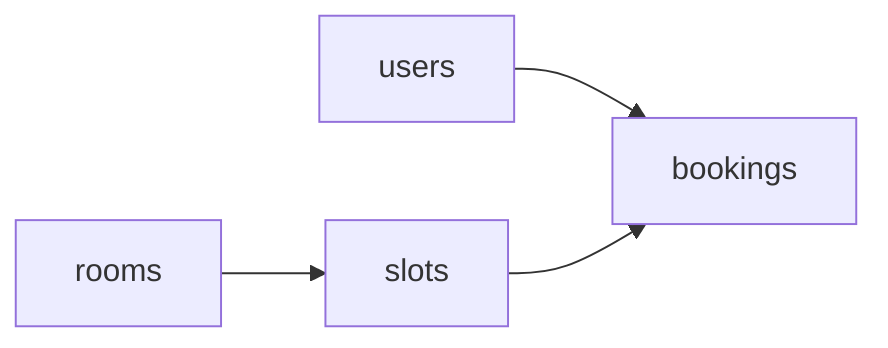

# ARCHITECTURE

## Principle: one folder per resource

Four people work in parallel, so code is organised **by resource, not by layer**. Each person owns a folder and rarely touches others' files, which means fewer merge conflicts.

```
back/
  app/
    main.py              # creates FastAPI app, includes routers
    core/
      config.py          # pydantic-settings, reads .env
      logging.py         # logging setup
      errors.py          # exception classes + handlers (BR-X1)
      security.py        # Sprint 2: JWT validation, role dependencies
    db/
      session.py         # engine, SessionLocal, get_db
      base.py            # declarative Base
    users/    {models.py, schemas.py, service.py, router.py}
    rooms/    {models.py, schemas.py, service.py, router.py}
    slots/    {models.py, schemas.py, service.py, router.py}
    bookings/ {models.py, schemas.py, service.py, router.py}
  alembic/
  tests/
    conftest.py          # shared fixtures: db session, client, factories
    users/  rooms/  slots/  bookings/
  requirements.txt
  .env.example
```

## Layers inside each resource

```
router.py   HTTP only: parse request, call service, return response
service.py  business rules (BR-*), raises domain errors
models.py   SQLAlchemy tables
schemas.py  Pydantic request/response
```

Routers never hold business rules, services never import FastAPI. This makes rules unit-testable without HTTP.

## Dependencies between resources



`bookings` depends on the other three. To avoid blocking, TECH tickets create all four models and the first migration on day 1, so everyone can work against the real schema.

## Shared conventions

- Table names plural snake_case (`time_slots`), Python models singular (`TimeSlot`).
- Endpoints plural kebab-case under `/api/v1` (e.g. `/api/v1/time-slots`). See `API_CONTRACT.md`.
- One error format (BR-X1), raised through `core/errors.py`.
- Sessions via the `get_db` dependency, overridden in tests.

## Test strategy

| Level | What | Where |
|-------|------|-------|
| Unit | Service rules with a test DB session | `tests/<resource>/test_service.py` |
| API | Each endpoint through `TestClient`, happy path + each error | `tests/<resource>/test_api.py` |

Minimum per endpoint (course requirement): one success test and one failing test per business rule it enforces.
