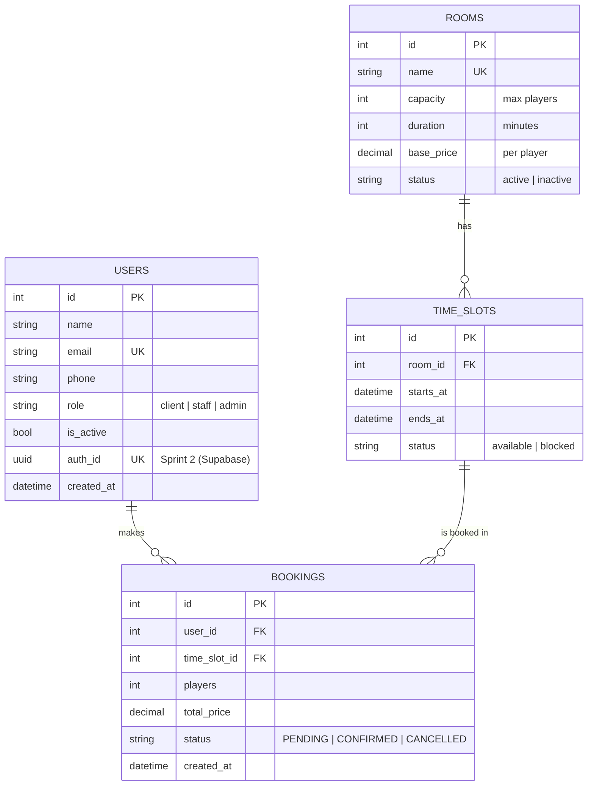
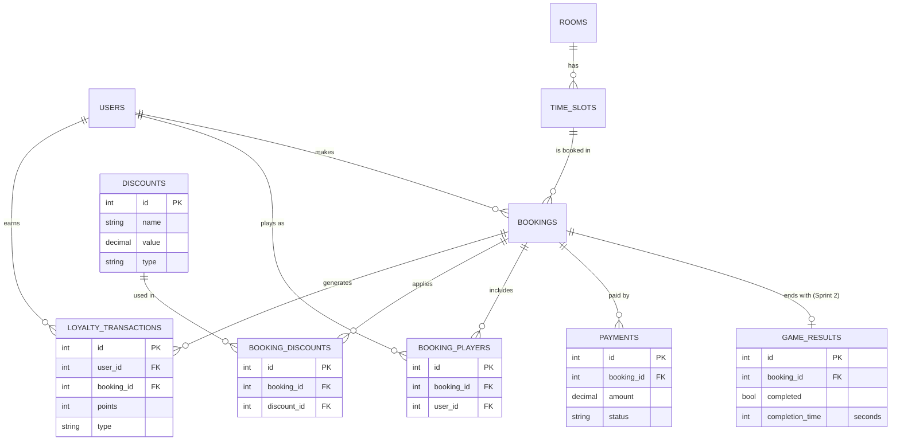
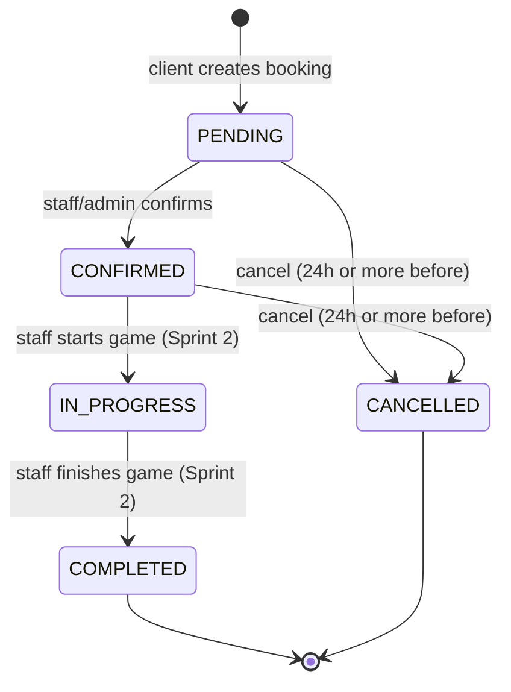
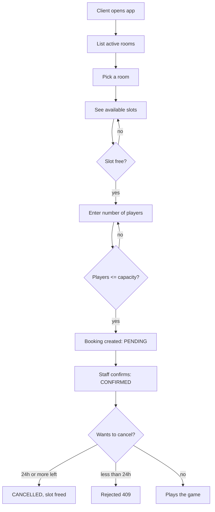
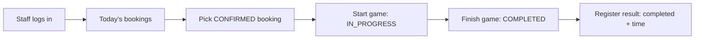
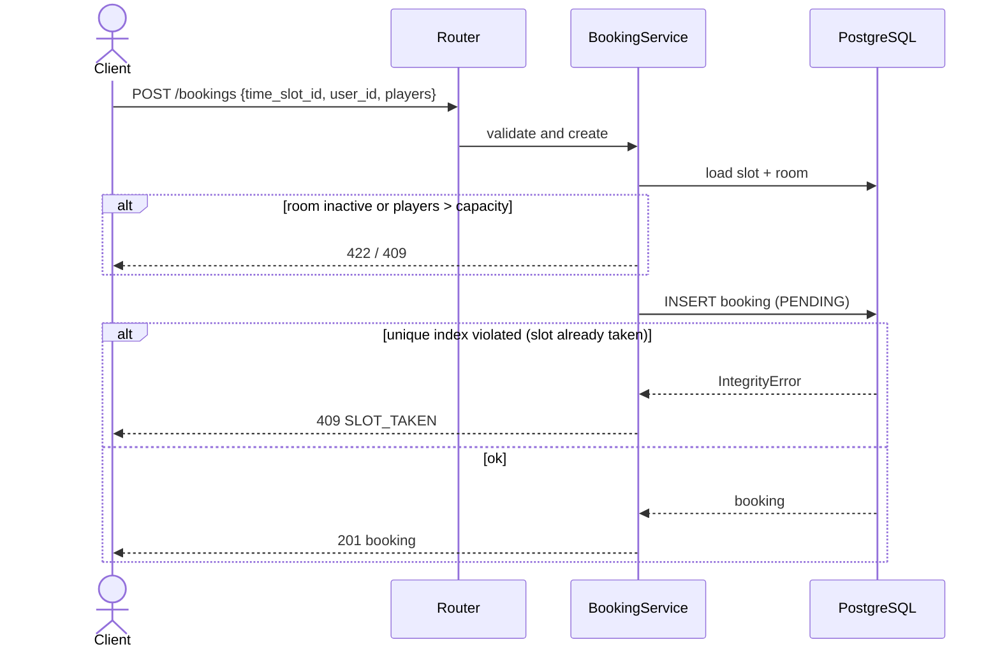
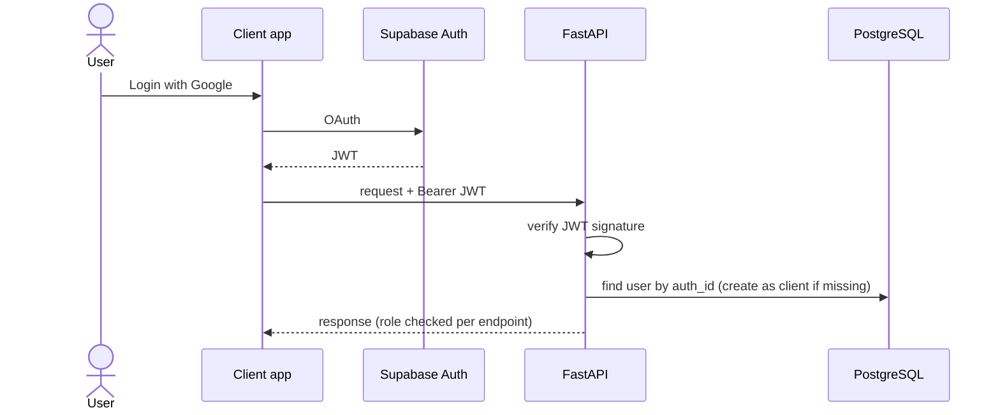

# DIAGRAMS

All diagrams are Mermaid: GitHub renders them directly.

## 1. ER diagram - MVP (Sprint 1)

Changes vs the team's full ER: `users` gets `role` + `is_active` (+ `auth_id` in Sprint 2); `time_slots.status` is only `available`/`blocked` (booked is computed, see BR-S5).

## 2. ER diagram - full vision (Phase 2/3)

The team's complete model. Tables with a Sprint tag are in scope, the rest are not committed.

## 3. Booking state machine

## 4. User flow - client booking

## 5. User flow - staff on game day (Sprint 2)

## 6. Booking creation sequence

## 7. Auth flow (Sprint 2)

