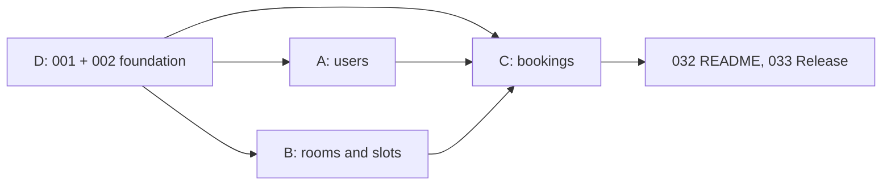

# WORK SPLIT

4 parts, **one per person, by epic**. Each person owns their epic from start to finish: model, schema, controller, route and tests (see `ARCHI.md`). Names go only in the table below, filled in on **Monday Oct 5**; each person then assigns themselves the matching tickets on the board.

## Who takes what

Fill in on **Monday Oct 5**. Write your name next to the part you pick, then assign yourself its tickets on the board.

| Part   | Epic                                                      | Taken by    |
| ------ | --------------------------------------------------------- | ----------- |
| **E1** | Users (US01 to US06)                                      | Leandro     |
| **E2** | Rooms & Slots (US07 to US12)                              | Isbel       |
| **E3** | Bookings (US13 to US17)                                   | Carolay     |
| **E4** | Foundation, Games, Admin (tickets 001, 002, US18 to US25) | M.Charlotte |

## How we work

1. Everyone does the **Sprint 1** tickets of their epic first (deadline Fri Oct 9).
2. If there is time left, they continue with the **Sprint 2** tickets of the same epic (deadline Mon Oct 19).
3. Everyone goes as far as they can. Sprint 2 tickets that nobody reached are taken by whoever is free first, at Sprint 2 planning.
4. Rooms and slots stay with **one person**: a slot belongs to a room and its rules depend on the room, so one owner means no conflicts on the same files.

| Part       | Epics                                   | Sprint 1                                   | Sprint 2                 |
| ---------- | --------------------------------------- | ------------------------------------------ | ------------------------ |
| **A** (E1) | E1 - Users                              | US01, US02, US03                           | US04, US05, US06         |
| **B** (E2) | E2 - Rooms & Slots                      | US07 to US12                               | -                        |
| **C** (E3) | E3 - Bookings                           | US13 to US16                               | US17                     |
| **D** (E4) | E0 - Foundation, E4 - Games, E5 - Admin | Foundation tickets 001, 002 (incl. Docker) | US18 to US25             |
| All        | Wrap-up                                 | 032 README, 033 Release 1                  | Retrospective, Release 2 |

Each part owns its own files (`models/room.py`, `routes/room.py`...), so merge conflicts stay rare. Ticket numbers match the board. Tests are written in the same ticket as the code (`CONTRIBUTING.md`).

## Part A - E1 Users

| Sprint | US   | Ticket   | Title                                                          |
| ------ | ---- | -------- | -------------------------------------------------------------- |
| 1      | US01 | 005      | Create user (done)                                             |
| 1      | US02 | 007      | View and update user profile                                   |
| 1      | US03 | 009      | List and deactivate users                                      |
| 2      | US04 | 035, 036 | Login with Supabase (Google), first login creates the user row |
| 2      | US05 | 037, 038 | Roles and permissions, role checks on the routes               |
| 2      | US06 | 039      | Own profile with `/users/me`                                   |

Light in Sprint 1, heavier in Sprint 2 (login and roles touch every route).

## Part B - E2 Rooms & Slots

| Sprint | US   | Ticket | Title                                       |
| ------ | ---- | ------ | ------------------------------------------- |
| 1      | US07 | 011    | Create room                                 |
| 1      | US08 | 013    | Edit room                                   |
| 1      | US09 | 015    | Deactivate room                             |
| 1      | US10 | 017    | List and get rooms                          |
| 1      | US11 | 019    | Configure time slots (create, edit, delete) |
| 1      | US11 | 020    | Time rules (past, overlap, inactive room)   |
| 1      | US12 | 022    | Check availability                          |

Biggest part of Sprint 1 (7 tickets, all small CRUDs). Nothing planned in Sprint 2: free to help others.

## Part C - E3 Bookings

| Sprint | US   | Ticket | Title                      |
| ------ | ---- | ------ | -------------------------- |
| 1      | US13 | 024    | Create booking             |
| 1      | US13 | 025    | Double-booking guard       |
| 1      | US14 | 027    | View bookings              |
| 1      | US15 | 029    | Modify booking (players)   |
| 1      | US16 | 031    | Cancel and confirm booking |
| 2      | US17 | 040    | Change slot of a booking   |

Most business rules of Sprint 1. It needs users, rooms and slots: start with the rules that do not depend on them (price, 24h cancellation).

## Part D - E0 Foundation, E4 Games, E5 Admin

| Sprint | Epic | US   | Ticket   | Title                                                                     |
| ------ | ---- | ---- | -------- | ------------------------------------------------------------------------- |
| 1      | E0   | -    | 001      | Project skeleton, config, logging, error handling                         |
| 1      | E0   | -    | 002      | Database setup and Docker: SQLAlchemy, Alembic, 4 models, first migration |
| 2      | E4   | US18 | 041      | Today's bookings (staff)                                                  |
| 2      | E4   | US19 | 042      | Start game                                                                |
| 2      | E4   | US20 | 043      | Finish game                                                               |
| 2      | E4   | US21 | 044      | Register game result                                                      |
| 2      | E4   | US22 | 045      | Game history                                                              |
| 2      | E5   | US23 | 046      | Business statistics                                                       |
| 2      | E5   | US24 | 047      | Export bookings to CSV                                                    |
| 2      | E5   | US25 | 048, 049 | Pagination and filters on list endpoints                                  |

Tickets 001 and 002 are done first: they unblock everyone. Then part D prepares the Sprint 2 work.

## Front (React client, label `front`)

The front tickets (064 to 085, see `TICKETS.md`) are split **by feature folder**, not by epic: each folder in `front/src/features/` has one owner, so nobody edits the same files. Names are filled in when a ticket is taken (same rule as the back: assign yourself on the board).

| Area | Feature folder | Tickets | Taken by |
|------|----------------|---------|----------|
| Setup, Docker, tooling | `app/`, `Dockerfile`, `nginx.conf` | 064 (In progress) | M.Charlotte |
| Shared base | `shared/`, `test/`, `rooms/model/roomThemes.js` | 065 | - |
| 3D corridor | `corridor/` | 066 | - |
| Rooms and transitions | `rooms/`, `styles/` | 067, 068 | - |
| Admin rooms and slots | `admin-rooms/` | 069, 070 | - |
| Booking flow | `booking/` | 071, 072, 073 | - |
| My bookings and history | `my-bookings/` | 074, 075, 076, 083 | - |
| Auth and profile | `auth/`, `profile/` | 077, 078, 079 | - |
| Admin users | `admin-users/` | 080 | - |
| Staff | `staff/` | 081, 082 | - |
| Admin statistics | `admin-stats/` | 084, 085 | - |

How the front stays conflict-free (`ARCHI.md`): each feature owns its routes (`routes.js`), its i18n file (`i18n/es/<feature>.js`) and its MSW handlers (`test/mocks/handlers/<feature>.js`). Shared files (`app/routes.jsx`, `i18n/es.js`, `test/mocks/handlers.js`) only compose them and should not be edited per ticket.

Order: 064 first (in progress, PR pending: it unblocks everyone), then 065 (theme, MSW, common UI) before the visual tickets. The 3D corridor (066) is mandatory for the demo, so it goes to one person from the start and runs in parallel with the booking flow: it only needs the rooms data and the `onEnter` contract. Front tickets whose back ticket is not merged yet start with MSW mocks.

## Everyone

| Sprint | Ticket   | Title                                            |
| ------ | -------- | ------------------------------------------------ |
| 1      | 032      | README with setup instructions and Swagger check |
| 1      | 033      | Release Sprint 1: PR `develop` to `main`         |
| 2      | 050, 051 | Retrospective, Release 2                         |

## Order and dependencies (Sprint 1)

- Day 1 (Fri Oct 2 - Mon Oct 5): part D does 001 and 002. The others read `API_CONTRACT.md` and `BUSINESS_RULES.md` and prepare their models and tests.
- Slots need rooms (same part B). Bookings (part C) need users, rooms and slots.
- Whoever finishes early helps part C (the heaviest), starting with tickets 027 and 031.

## Rules for everyone

- One ticket = one branch = one PR to `develop`, reviewed by another person (`CONTRIBUTING.md`).
- If a ticket is blocked ("Blocked by" on the board), say it in the team chat.
- If you change an endpoint, update `API_CONTRACT.md` in the same PR.
